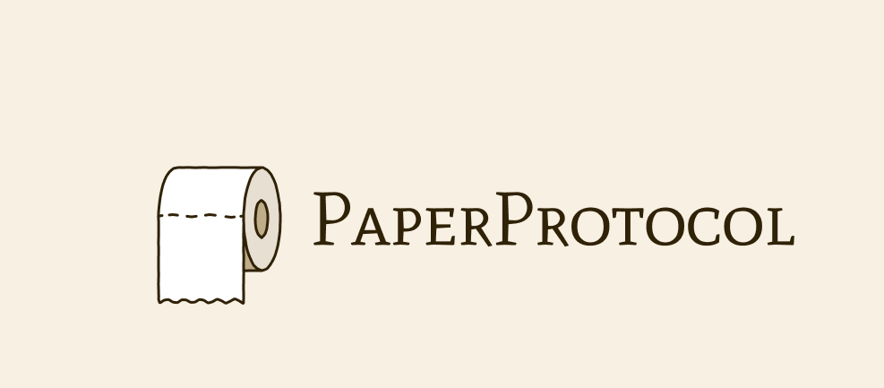
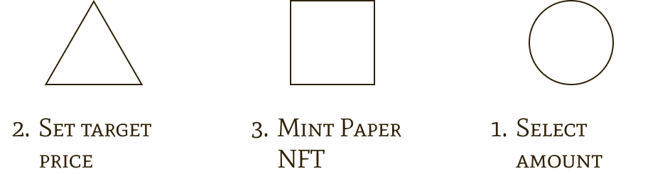

<div align="center" style="width: 100%; height: 150px; margin-bottom: 20px;">
  
</div>

<div align="center">
  
  ### The first protocol that guarantees you will achieve your desired price
  
  **We help to forge paper hands into diamond hands 💎**
  
  <br/>
  
  *ETHKyiv Hackathon 2025 Project*
</div>

<br/>

## Overview

Paper Protocol is a revolutionary DeFi solution that ensures traders achieve their target prices through smart contract automation. Built for the ETHKyiv hackathon 2025, the protocol leverages **Redstone** price feeds and **The Graph** for efficient data indexing and querying.

## How It Works?

<div align="center">
  
</div>

1. **Select Amount**: Choose the amount of tokens you want to lock
2. **Set Target Price**: Define your desired exit price  
3. **Mint Paper NFT**: Receive an NFT representing your locked position that automatically executes at your target price

## Deployed Contracts (Base Sepolia)

| Contract | Address |
|----------|---------|
| ETH Oracle | `0xB540Cd825c455711b075073Ef7C74b86B3ab9f4b` |
| Adapter | `0x5C793701fA61433385071961f6bF8748c98c5ca9` |
| Protocol | `0x14C59Ba26193C65d256C41f1077c8867eB41c805` |

## Technology Stack

- **Redstone**: Real-time price feed oracle
- **The Graph**: Decentralized indexing protocol

## Graph Integration

### Deployed Subgraph

Access our deployed subgraph at:
```
https://gateway.thegraph.com/api/subgraphs/id/7XPpGRdToAW4AZotojMxVVtdcZMBvXEFcktb3Ah7chWP
```

### Querying the Subgraph

Example query to fetch top ETH price targets:
```graphql
{
  priceTargets(
    first: 10, 
    where: { asset: "ETH" },
    orderBy: targetPrice, 
    orderDirection: desc
  ) {
    id
    user
    asset
    lockedAmount
    targetPrice
    currentPrice
    createdAt
    status
  }
}
```

### Using the Graph API

To interact with our subgraph, send POST requests to the endpoint with your GraphQL query:

```bash
curl -X POST \
  -H "Content-Type: application/json" \
  -H "Authorization: Bearer YOUR_API_KEY" \
  -d '{"query": "{ priceTargets(first: 5, where: { asset: \"ETH\" }) { id user targetPrice lockedAmount status } }"}' \
  https://gateway.thegraph.com/api/subgraphs/id/7XPpGRdToAW4AZotojMxVVtdcZMBvXEFcktb3Ah7chWP
```

Note: Replace `YOUR_API_KEY` with your Graph API key from [The Graph Studio](https://thegraph.com/studio/).

## License

MIT 